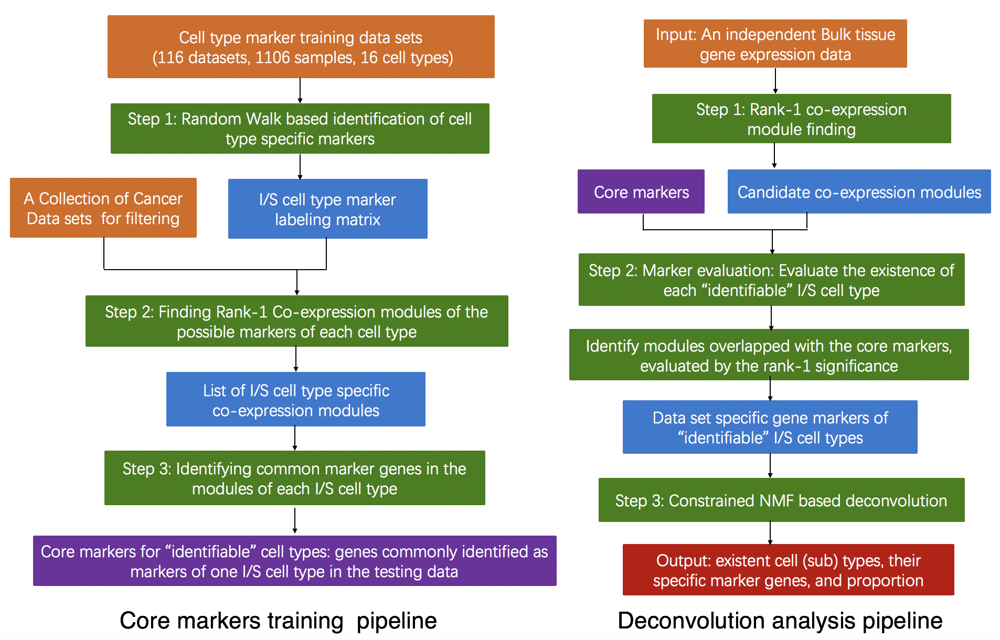

# SSMD: A semi-supervised approach for a robust identification of cell types and deconvolution of mouse transcriptomics data

## Description

Multiple deconvolution methods have been developed for investigating the
heterogeneous immune and stromal (I/S) cell types in human cancer tissue
to estimate their relative abundances using transcriptomic data.
However, there is a lack of a robust method and user-friendly software
for mouse transcriptomic data deconvolution. Here, we developed a novel
semi-supervised approach, namely SSMD, by (i) deriving potential I/S
cell signature genes from a large collection of mouse data sets to form
a marker labeling matrix; (ii) implementing a rank-1 sub matrix
identification method to test the presence of I/S cell types and
identify data set specific I/S cell markers; and (iii) utilizing a
constrained non-negative matrix factorization (NMF) based framework to
account for diversity of mouse models. The new method was validated on
single cell RNA-seq simulated bulk tissue data and independent
immuno-assay data. The method is applied to mouse prostate cancer data
sets to infer the level of anti-cancer immune cell populations.



## Installation

```
install.packages("devtools")
devtools::install_github("zy26/SSMD")
```

## Usage

```
estimate.proportion <- function(data, lambda = lambda)
```

## Arguments

* `data`        input gene expression matrix. MGI gene symbol should be as their row names
* `parameter`   threshold of mean correlation to define rank-1 co-expression module

## Value

An object of class is also invisibly returned. This is a list containing
the following components:

* `Stat_all`      statistics for all rank-1 co-expression module. `CT`: cell type; mean: mean correlation inside the module; `Core_overlap_number`: Overlap number with core marker list; `Core_overlap_rate`: overlap rate with core marker list; `BCV_rank`: bcv rank of the first base
* `module_keep`   modules with the high overlap number with core marker list for each cell type
* `proportion`     estimated proportion for each cell type

## Examples

```
#load your own gene expression data
load('example_bulk.RData')
estimate.proportion(data, lambda = 0.8)
```
